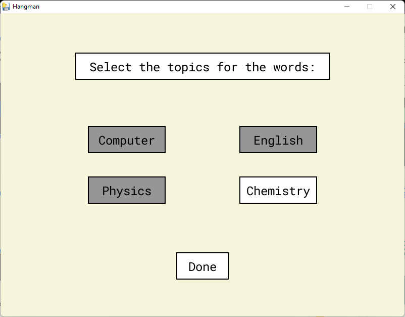
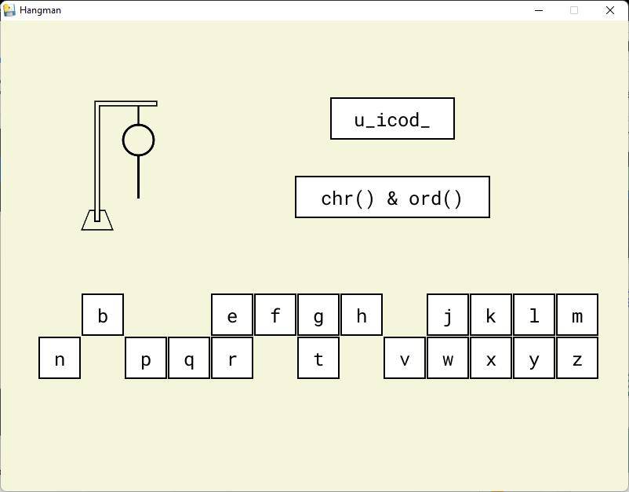
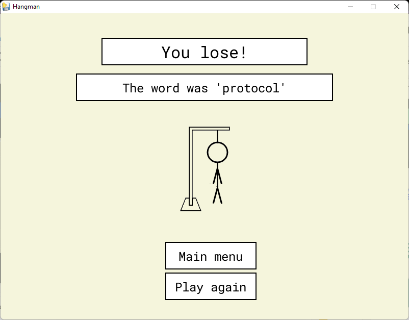

<a name="readme-top"></a>

<!-- PROJECT LOGO -->
<br />
<div align="center">
  <a href="https://github.com/DevChrome/Hangman">
    
  </a>

<h3 align="center">Hangman</h3>

  <p align="center">
    A simple hangman game made in python using pygame
  </p>
</div>


<!-- TABLE OF CONTENTS -->
<details>
  <summary>Table of Contents</summary>
  <ol>
    <li>
      <a href="#about-the-project">About The Project</a>
      <ul>
        <li><a href="#built-with">Built With</a></li>
      </ul>
    </li>
    <li>
      <a href="#running-from-source">Running From Source</a>
      <ul>
        <li><a href="#prerequisites">Prerequisites</a></li>
        <li><a href="#instructions">Instructions</a></li>
      </ul>
    </li>
    <li><a href="#screenshots">Screenshots</a></li>
    <li><a href="#license">License</a></li>
  </ol>
</details>


<!-- ABOUT THE PROJECT -->
## About The Project

This is a fun little version of the popular game Hangman, made in python, using simple graphics and file handling concepts.
<br>
Players can choose topics to be asked words on, and the guess them letter by letter within 6 tries to save the hangman, otherwise the hangman dies and the game is lost.
<br><br>
This is an attempt to show how learning new words and concepts can be made more fun and interactive for students, by making use of games and visual media to keep them learning while entertained.
<br>
In recent years, with regular disruption of education of children, it has become increasingly more important to make learning easier and more accessible to them, whilst also making sure they don’t lose interest in it.
<br><br>
This game, while simple, can be extended for students of higher classes by various ways, such as incrementally increasing the difficulty, or by introducing additional challenges.
<br>
It can even be presented as a learning and creative exercise to the player to add more words, and they can even be encouraged to tinker around with the source code  to see how they themselves can extend the game.


### Built With

[![Pygame][pygame-img]][pygame-url]

<!-- GETTING STARTED -->
## Running From Source

To get this project running locally from source, follow these steps:

### Prerequisites

* Python interpreter (>= 3.8)

### Instructions

1. Clone the repo
   ```sh
   git clone https://github.com/DevChrome/Hangman.git
   ```
2. Install the pygame module
   ```sh
   pip install pygame
   ```
3. Run the main.py file
   ```sh
   python3 ./main.py
   ```

<!-- USAGE EXAMPLES -->
## Screenshots




<!-- LICENSE -->
## License

Distributed under the MIT License. See `LICENSE.txt` for more information.


<p align="right">[<a href="#readme-top">Back To Top</a>]</p>

<!-- MARKDOWN LINKS & IMAGES -->
[pygame-img]: https://www.pygame.org/images/logo_lofi.png
[pygame-url]: https://github.com/pygame/pygame
